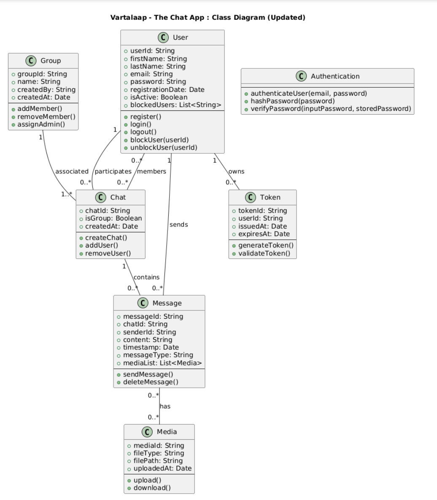

# Vartalaap – The Chat App : Class Diagram

## Description

The class diagram of **Vartalaap – The Chat App** models the entities, attributes, behaviors, and relationships required to support the core functionalities of the application.

### **1. User**
- **Attributes**: `userId`, `firstName`, `lastName`, `email`, `password`, `registrationDate`, `isActive`, `blockedUsers[]`
- **Behavior**: `register()`, `login()`, `logout()`
- **Description**: Represents a registered user of the application. A user can participate in chats, send messages, and maintain an array of blocked users for privacy and control.

---

### **2. Token**
- **Attributes**: `tokenId`, `userId`, `issuedAt`, `expiresAt`
- **Behavior**: `generateToken()`, `validateToken()`
- **Description**: Represents authentication tokens for secure sessions. Each user can have multiple active tokens.

---

### **3. Chat**
- **Attributes**: `chatId`, `isGroup`, `createdAt`
- **Behavior**: `createChat()`, `addUser()`, `removeUser()`
- **Description**: Represents a communication channel, either one-to-one or group-based. Each chat can have multiple users and messages.

---

### **4. Group**
- **Attributes**: `groupId`, `name`, `createdBy`, `createdAt`
- **Behavior**: `addMember()`, `removeMember()`, `assignAdmin()`
- **Description**: A specialized chat with multiple members. Groups support administrative functionalities like adding/removing members and assigning admins.

---

### **5. Message**
- **Attributes**: `messageId`, `chatId`, `senderId`, `content`, `timestamp`, `messageType`, `mediaList[]`
- **Behavior**: `sendMessage()`, `deleteMessage()`
- **Description**: Represents messages exchanged in a chat. A message can contain text or multiple media attachments.

---

### **6. Media**
- **Attributes**: `mediaId`, `messageId`, `fileType`, `filePath`, `uploadedAt`
- **Behavior**: `upload()`, `download()`
- **Description**: Represents a media file (image, video, audio, or document) associated with a message. A message may have multiple media objects.

---

### **7. Block**
- **Attributes**: `blockId`, `blockedBy`, `blockedUser`, `createdAt`
- **Behavior**: `blockUser()`, `unblockUser()`
- **Description**: Represents the blocking functionality. While stored as a separate entity, each user also maintains a list (`blockedUsers[]`) for quick lookups.

---

### **8. Authentication**
- **Behavior**: `authenticateUser(email, password)`, `hashPassword(password)`, `verifyPassword(inputPassword, storedPassword)`
- **Description**: Handles secure login and password management for the application.

---

## **Relationships**
- **User ↔ Chat**: A user can participate in multiple chats, and a chat can have multiple users.
- **User ↔ Message**: A user can send many messages.
- **User ↔ Token**: A user can own multiple tokens for active sessions.
- **User ↔ Block**: A user can block multiple other users (also stored in `blockedUsers[]`).
- **Chat ↔ Message**: A chat contains multiple messages.
- **Message ↔ Media**: A message can have multiple media attachments.
- **Group ↔ Chat**: Each group is associated with one chat.

---

This class diagram comprehensively models the **functionalities of Vartalaap – The Chat App**, covering authentication, user management, chat handling, messaging, media sharing, group chats, and blocking features.
